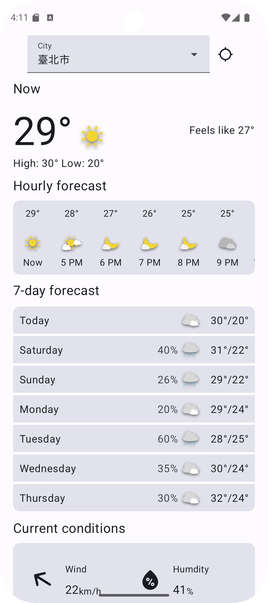
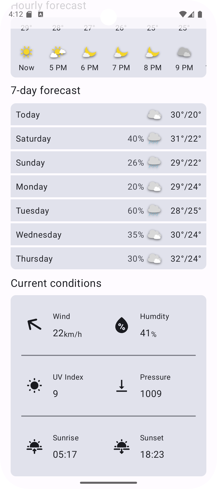
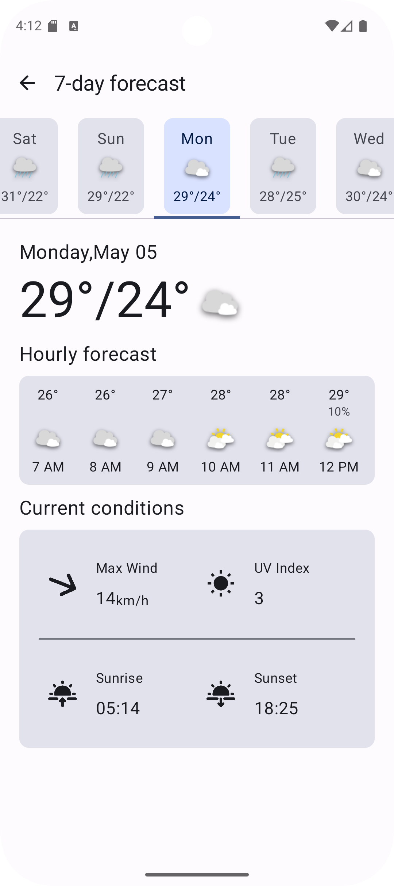
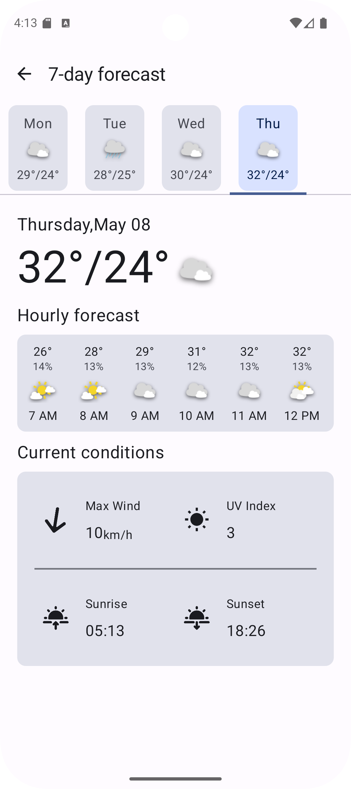

# Weather App (天氣預報應用程式)

這是一個 Android 天氣預報應用程式，利用 **Jetpack Compose** 構建使用者介面，並遵循 **MVVM** 架構模式開發。
應用程式能根據使用者目前的 **GPS 位置**，透過整合外部天氣 **API**，顯示**即時天氣資訊**及**未來數天的天氣預測**。

## 專案特色

* **定位服務整合：** 透過 GPS 自動獲取使用者當前位置的經緯度。
* **即時天氣顯示：** 顯示當前位置的最新天氣狀況（例如：溫度、天氣描述、濕度等）。
* **未來天氣預報：** 提供未來 [七天] 的天氣預測數據。
* **API 數據獲取：** 透過呼叫外部天氣 API 來獲取準確且即時的天氣資訊。
* **現代化 UI：** 使用 Jetpack Compose 構建流暢、直觀且響應式的使用者介面。
* **MVVM 架構：** 清晰分離關注點，提升程式碼的可測試性、可維護性與擴充性。

## 使用技術

* **程式語言：** Kotlin
* **UI 工具包：** Jetpack Compose
* **架構模式：** MVVM (Model-View-ViewModel)
* **非同步處理：** Kotlin Coroutines
* **網路請求：** Retrofit
* **位置服務：** Google Play Services Location API
* **序列化/反序列化：** Gson

## API

本專案的天氣數據主要來自 [Open-Meteo](https://open-meteo.com/)。

## 專案畫面

<table style="border: none; border-collapse: collapse; width: 100%;" >
  <tr>
    <td style="border: none; padding: 0; vertical-align: top; text-align: center;">
      
    </td>
    <td style="border: none; padding: 0; vertical-align: top; text-align: center;">
      
    </td>
  </tr>
  <tr>
    <td style="border: none; padding: 0; vertical-align: top; text-align: center;">
      
    </td>
    <td style="border: none; padding: 0; vertical-align: top; text-align: center;">
      
    </td>
  </tr>
</table>
